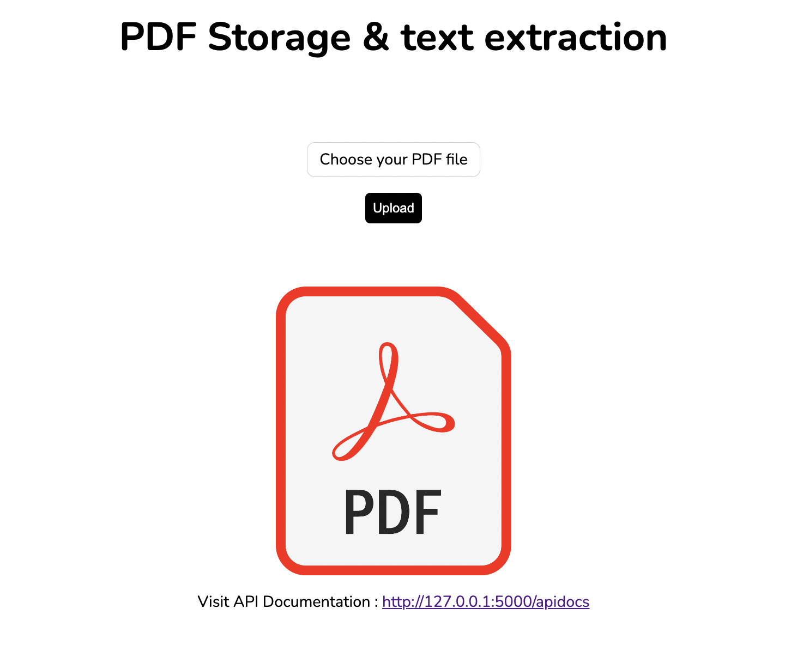

# PDF Storage & Text extraction



## Project structure

    .
    ├── static                  #Basic styles
    │   ├── error.css
    │   └── styles.css
    │
    └── templates               #HTML templates
    │   ├── error.html
    │   ├── index.html
    │   ├── pdf_info.html
    │   └── pdf_text.html
    │
    └── tests                   #Tests
    │   ├── conftest.py
    │   └── test_app.py
    │
    ├── __init__.py             #App entrypoint & modules
    ├── app.py
    ├── db.py
    ├── models.py
    └── routes.py

## API Contract

Available at `http://localhost:5000/apidocs`


## Requirements

- Inside the requirements.txt file with the version dependencies

## Installation & Running

After unzipping the folder or cloning the repository

```bash
#With Docker
$ docker build -t flask-app .
$ docker run -p 5000:5000 flask-app
```

```bash
#With python3 locally
$ pip install -r requirements.txt
$ export FLASK_APP=__init__ #use SET for Windows machine
$ flask run
```

## Stack

- [Python](https://www.python.org/)
- [Flask](https://flask.palletsprojects.com/en/2.2.x/)
- [SQLite](https://sqlite.org/index.html)
- [Docker](https://www.docker.com/)
- [Pytest](https://docs.pytest.org/en/7.2.x/)

## Author

- WANG David - SIO CentraleSupélec david.wang@student-cs.fr
